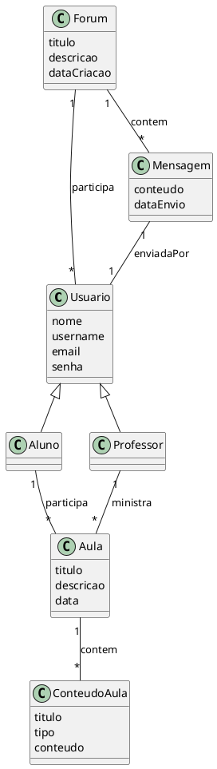
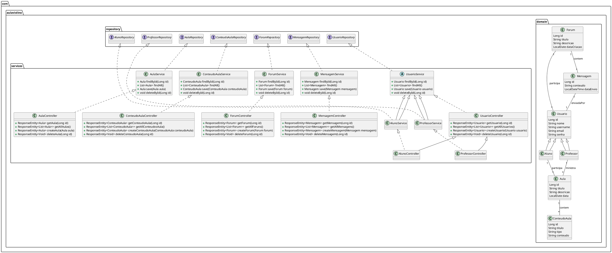

Projeto Prática Profissional em Análise

# Diagrama de Dominio

```plantuml
left to right direction 
@startuml
class Usuario {
    nome
    username
    email
    senha
}
class Aluno {
}
class Professor {
}
class Aula {
    titulo
    descricao
    data
}
class ConteudoAula {
    titulo
    tipo
    conteudo
}
class Forum {
    titulo
    descricao
    dataCriacao
}
class Mensagem {
    conteudo
    dataEnvio
}

Usuario <|-- Aluno
Usuario <|-- Professor
Aluno "1" -- "*" Aula : participa
Professor "1" -- "*" Aula : ministra
Aula "1" -- "*" ConteudoAula : contem
Forum "1" -- "*" Usuario : participa
Forum "1" -- "*" Mensagem : contem
Mensagem "1" -- "1" Usuario : enviadaPor
@enduml
```

# Diagrama de Classe

```plantuml
left to right direction 
@startuml
package com.aulaviolino.domain {
class Usuario {
    Long id
    String nome
    String username
    String email
    String senha
}
class Aluno extends Usuario {
}
class Professor extends Usuario {
}
class Aula {
    Long id
    String titulo
    String descricao
    LocalDate data
}
class ConteudoAula {
    Long id
    String titulo
    String tipo
    String conteudo
}
class Forum {
    Long id
    String titulo
    String descricao
    LocalDate dataCriacao
}
class Mensagem {
    Long id
    String conteudo
    LocalDateTime dataEnvio
}
}
package com.aulaviolino.repository {
interface UsuarioRepository {
}
interface AlunoRepository {
}
interface ProfessorRepository {
}
interface AulaRepository {
}
interface ConteudoAulaRepository {
}
interface ForumRepository {
}
interface MensagemRepository {
}
}
package com.aulaviolino.services {
abstract class UsuarioService {
    + Usuario findById(Long id)
    + List<Usuario> findAll()
    + Usuario save(Usuario usuario)
    + void deleteById(Long id)
}
class AlunoService extends UsuarioService {
}
class ProfessorService extends UsuarioService {
}
class AulaService {
    + Aula findById(Long id)
    + List<Aula> findAll()
    + Aula save(Aula aula)
    + void deleteById(Long id)
}
class ConteudoAulaService {
    + ConteudoAula findById(Long id)
    + List<ConteudoAula> findAll()
    + ConteudoAula save(ConteudoAula conteudoAula)
    + void deleteById(Long id)
}
class ForumService {
    + Forum findById(Long id)
    + List<Forum> findAll()
    + Forum save(Forum forum)
    + void deleteById(Long id)
}
class MensagemService {
    + Mensagem findById(Long id)
    + List<Mensagem> findAll()
    + Mensagem save(Mensagem mensagem)
    + void deleteById(Long id)
}

class UsuarioController {
    + ResponseEntity<Usuario> getUsuario(Long id)
    + ResponseEntity<List<Usuario>> getAllUsuarios()
    + ResponseEntity<Usuario> createUsuario(Usuario usuario)
    + ResponseEntity<Void> deleteUsuario(Long id)
}
class AlunoController extends UsuarioController {
}
class ProfessorController extends UsuarioController {
}
class AulaController {
    + ResponseEntity<Aula> getAula(Long id)
    + ResponseEntity<List<Aula>> getAllAulas()
    + ResponseEntity<Aula> createAula(Aula aula)
    + ResponseEntity<Void> deleteAula(Long id)
}
class ConteudoAulaController {
    + ResponseEntity<ConteudoAula> getConteudoAula(Long id)
    + ResponseEntity<List<ConteudoAula>> getAllConteudosAula()
    + ResponseEntity<ConteudoAula> createConteudoAula(ConteudoAula conteudoAula)
    + ResponseEntity<Void> deleteConteudoAula(Long id)
}
class ForumController {
    + ResponseEntity<Forum> getForum(Long id)
    + ResponseEntity<List<Forum>> getAllForuns()
    + ResponseEntity<Forum> createForum(Forum forum)
    + ResponseEntity<Void> deleteForum(Long id)
}
class MensagemController {
    + ResponseEntity<Mensagem> getMensagem(Long id)
    + ResponseEntity<List<Mensagem>> getAllMensagens()
    + ResponseEntity<Mensagem> createMensagem(Mensagem mensagem)
    + ResponseEntity<Void> deleteMensagem(Long id)
}
}

Usuario <|-- Aluno
Usuario <|-- Professor
Aluno "1" -- "*" Aula : participa
Professor "1" -- "*" Aula : ministra
Aula "1" -- "*" ConteudoAula : contem
Forum "1" -- "*" Usuario : participa
Forum "1" -- "*" Mensagem : contem
Mensagem "1" -- "1" Usuario : enviadaPor

UsuarioRepository <|.. UsuarioService
AlunoRepository <|.. AlunoService
ProfessorRepository <|.. ProfessorService
AulaRepository <|.. AulaService
ConteudoAulaRepository <|.. ConteudoAulaService
ForumRepository <|.. ForumService
MensagemRepository <|.. MensagemService
UsuarioService <|.. UsuarioController
AlunoService <|.. AlunoController
ProfessorService <|.. ProfessorController
AulaService <|.. AulaController
ConteudoAulaService <|.. ConteudoAulaController
ForumService <|.. ForumController
MensagemService <|.. MensagemController
UsuarioService <|-- AlunoService
UsuarioService <|-- ProfessorService


@enduml
```